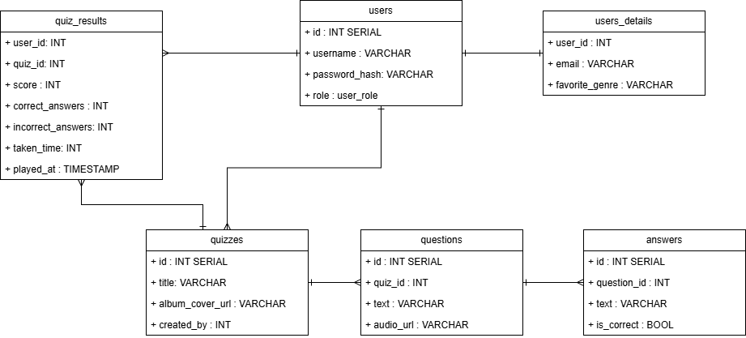
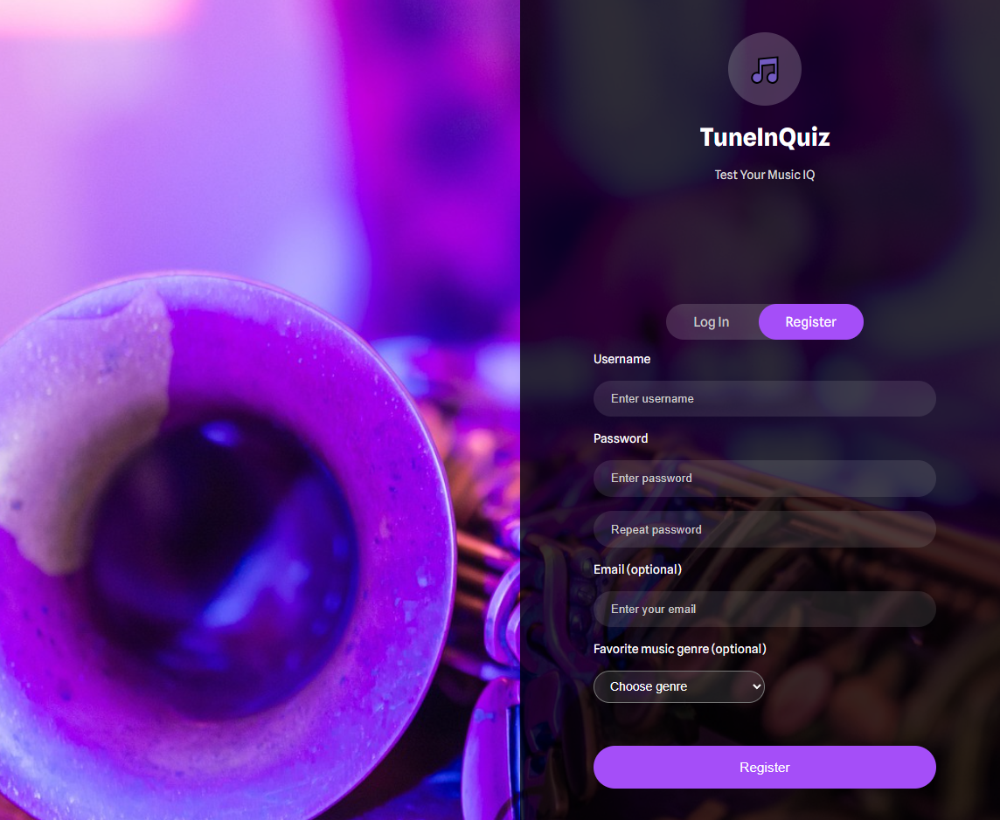
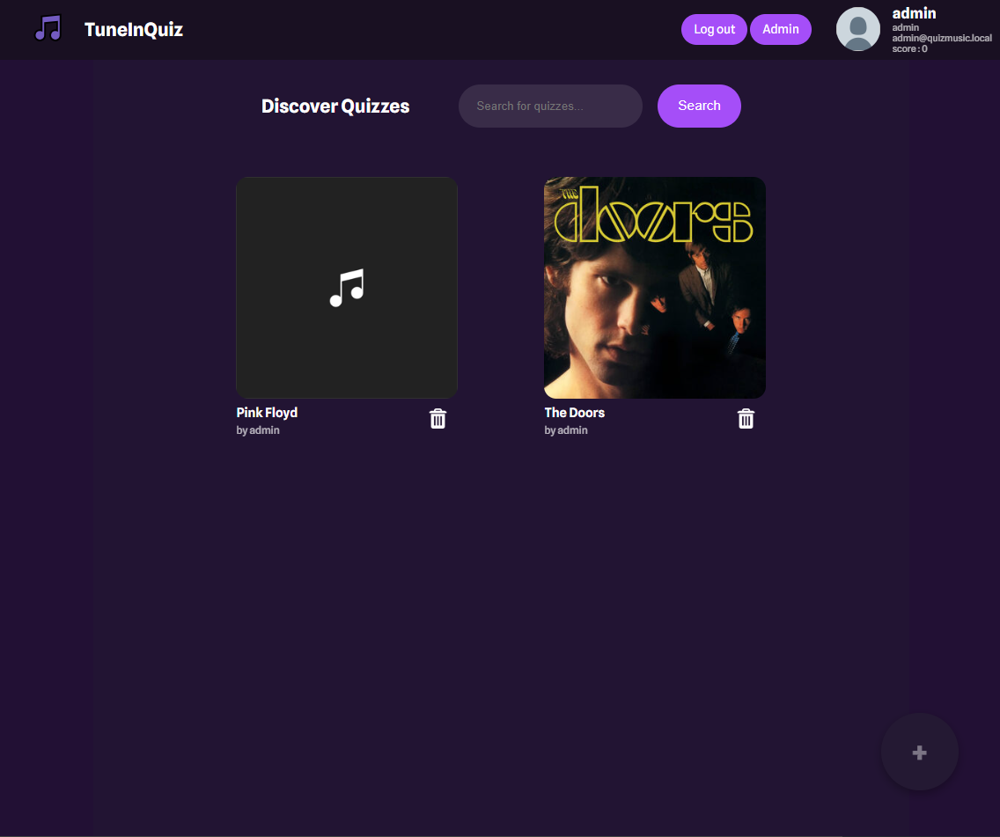
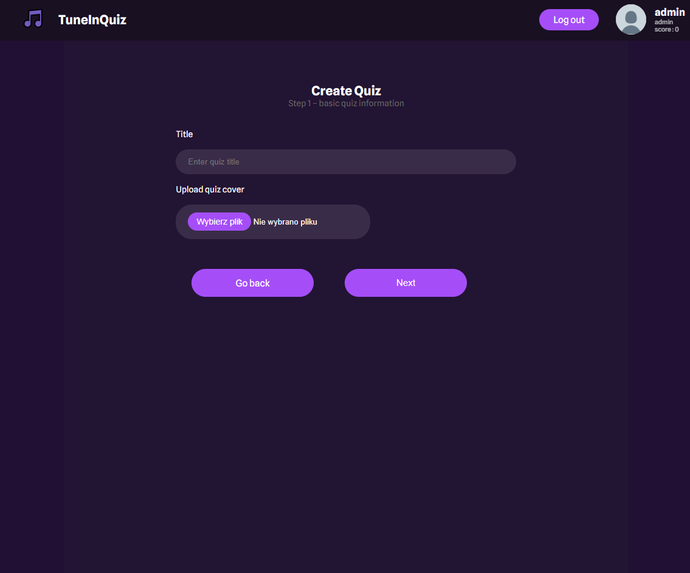
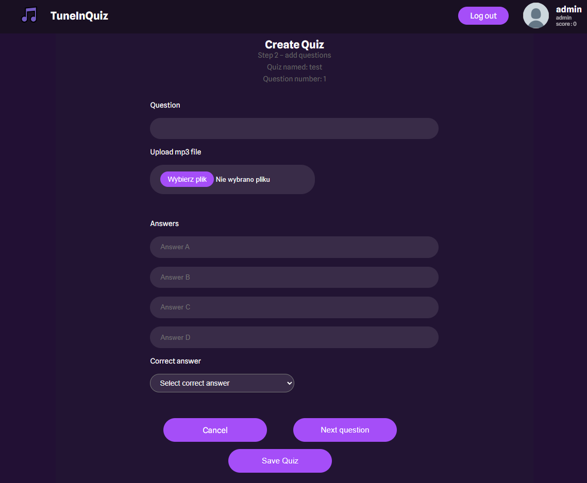
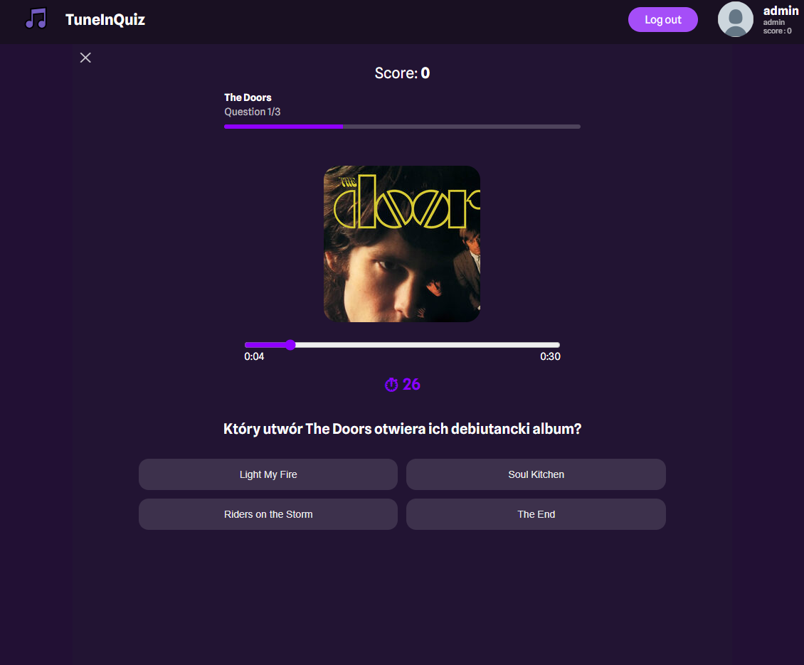
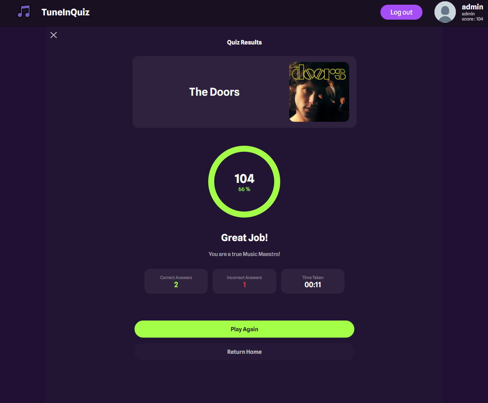
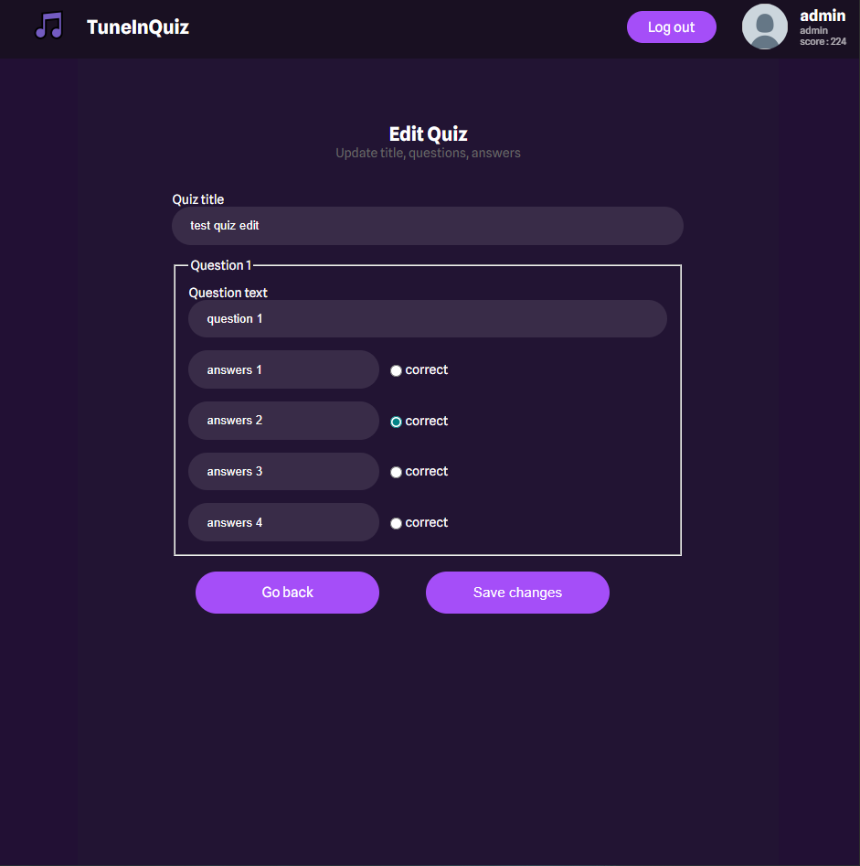
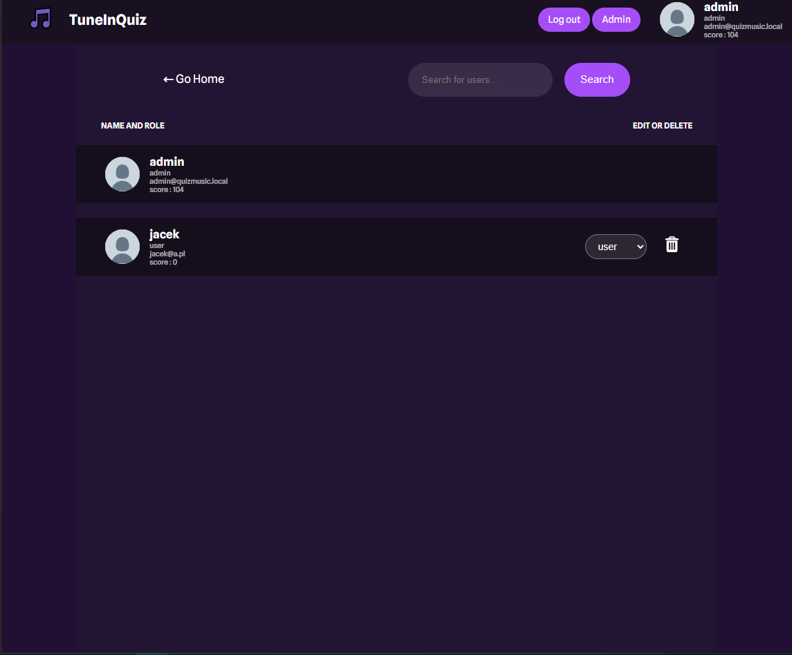
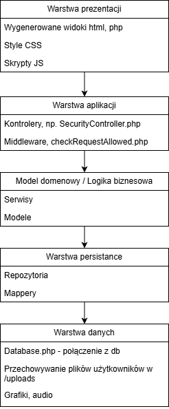

# Tune In Quiz
Edukacja

## Opis Aplikacji

Aplikacja quizowa do ćwiczenia rozpoznawania utworów muzycznych odtwarzanych z plików MP3. Użytkownik odpowiada na pytania typu „co to za utwór” lub „kto zagrał solówkę”. Zawiera logowanie, ekran główny z wyborem gry lub tworzeniem quizu, odtwarzanie i ocenę wyników, a także panel admina do zarządzania użytkownikami.

# Dokumentacja

## Diagram ERD

https://drive.google.com/file/d/1L9fes6S468Pz1fw1LcLS8Wl7gbF4a2hT/view?usp=sharing

## Screeny Aplikacji

Register

Login

Home

Create Quiz

Add Question

Play Quiz

Quiz Result

Edit Quiz

Admin Page

## Diagram architektury aplikacji

## Instrukcja uruchomienia

Uruchomienie kontenera:  
<code>docker compose up</code>  
Uruchomienie testów:  
<code>docker-compose run --rm php phpunit --testdox tests</code>  
<code>docker-compose run --rm php sh tests/integration/register_test.sh</code>  

Zmienne środowiskowe: .env
<code>
DB_HOST=db
DB_NAME=db
DB_USER=docker
DB_PASS=docker
</code>

# Scenariusz testowy – Quiz, Role, Autoryzacja

## Cel testu
Sprawdzenie poprawności działania systemu quizów w zakresie:
- rejestracji i logowania użytkownika,
- obsługi ról (`user`, `admin`),
- operacji CRUD na quizach,
- zabezpieczeń dostępu (błędy 401 i 403).

---

## Warunki wstępne
- Aplikacja uruchomiona
- Brak aktywnej sesji użytkownika
- Istnieje konto administratora

---

## Scenariusz testowy

### 1. Rejestracja użytkownika
- Użytkownik przechodzi na `/register`
- Wprowadza poprawne dane rejestracyjne
- Zatwierdza formularz

**Oczekiwany rezultat:**
- Konto użytkownika zostaje utworzone
- Wyświetlany jest komunikat o poprawnej rejestracji

---

### 2. Logowanie
- Użytkownik przechodzi na `/login`
- Podaje poprawny login i hasło

**Oczekiwany rezultat:**
- Utworzona zostaje sesja użytkownika
- Rola użytkownika ustawiona jako `user`
- Przekierowanie na `/home`

**Błąd:**
- Błędne dane logowania -> przekierowanie na `/login`

---

### 3. Strona główna (Home)
- Użytkownik wchodzi na `/home`

**Oczekiwany rezultat:**
- Wyświetlana jest lista quizów
- Dostęp mają role `user` oraz `admin`

**Błąd:**
- Brak sesji ->błąd `401`

---

### 4. Tworzenie quizu
- Użytkownik przechodzi na `/create_quiz`
- Wprowadza tytuł quizu
- Opcjonalnie dodaje okładkę
- Zatwierdza formularz

**Oczekiwany rezultat:**
- Dane quizu zapisane w sesji
- Przekierowanie do `/add_question`

---

### 5. Dodanie pytania
- Użytkownik dodaje treść pytania
- Dodaje plik audio
- Dodaje odpowiedzi i wskazuje poprawną
- Wybiera opcję „Next question”

**Oczekiwany rezultat:**
- Pytanie zapisane w sesji quizu

---

### 6. Zapis quizu
- Użytkownik przechodzi na `/save_quiz`

**Oczekiwany rezultat:**
- Quiz zapisany w bazie danych
- Sesja quizu zostaje wyczyszczona
- Przekierowanie na stronę sukcesu

---

### 7. Rozgrywka quizu
- Użytkownik uruchamia quiz
- Rozwiązuje pytania
- Kończy quiz

**Oczekiwany rezultat:**
- Wynik zapisany w bazie danych
- Wyświetlony ekran z podsumowaniem

---

### 7b. Poprawny zapis wyniku quizu (test wyzwalacza)
- Użytkownik kończy quiz
- System zapisuje wynik do tabeli `quiz_results`

**Oczekiwany rezultat:**
- Rekord zostaje poprawnie zapisany w bazie danych
- Operacja INSERT/UPDATE zostaje przerwana
- Baza danych zgłasza wyjątek

**Błąd**
- `correct_answers + incorrect_answers ≠ liczba pytań w quizie` 
- Operacja INSERT/UPDATE zostaje przerwana
- Baza danych zgłasza wyjątek

---

### 8. Edytowanie quizu
- Właściciel quizu lub admin edytuje swój quiz

**Oczekiwany rezultat:**
- Quiz zostaje zmieniony

**Błąd:**
- Próba usunięcia edycji przez innego użytkownika → **403 Forbidden**

---

### 9. Usunięcie quizu
- Właściciel quizu lub admin usuwa swój quiz

**Oczekiwany rezultat:**
- Quiz zostaje usunięty
- Quiz nie jest widoczny na liście

**Błąd:**
- Próba usunięcia quizu przez innego użytkownika → **403 Forbidden**

---

### 10. Panel administratora
- Administrator przechodzi na `/admin`

**Oczekiwany rezultat:**
- Wyświetlana lista użytkowników
- Widoczne dostępne role

**Błąd:**
- Użytkownik bez roli `admin` → **403 Forbidden**

---

### 11. Zmiana roli użytkownika
- Administrator zmienia rolę innego użytkownika

**Oczekiwany rezultat:**
- Rola użytkownika zostaje zmieniona
- Zmiana obowiązuje po ponownym logowaniu

**Błąd:**
- Próba zmiany własnej roli → **400 Bad Request**

---

### 12. Usunięcie użytkownika
- Administrator usuwa wybranego użytkownika

**Oczekiwany rezultat:**
- Użytkownik zostaje usunięty wraz powiązanymi zasobami (np. wyniki, stworzone quizu)

**Błąd:**
- Próba usunięcia samego siebie → **400 Bad Request**

---

# ✅ CHECKLISTA DONE

### Architektura i bezpieczeństwo
- Zastosowana architektura **MVC / frontend–backend**
- Separacja logiki biznesowej, widoków i dostępu do danych
- Middleware zabezpieczające endpointy (`AllowedMethods`, `AllowedRules`)
- Ochrona przed nieautoryzowanym dostępem do zasobów

---

### Interfejs użytkownika
- Aplikacja responsywna

---

### Autoryzacja i sesje
- Rejestracja użytkownika
- Logowanie użytkownika
- Utrzymanie sesji użytkownika
- Regeneracja ID sesji po logowaniu
- Wylogowanie użytkownika
- Dostęp do aplikacji tylko dla zalogowanych użytkowników

---

### Role i uprawnienia
- Obsługa ról `user` i `admin`
- Weryfikacja uprawnień w trakcie działania aplikacji
- Ograniczenie dostępu do panelu administratora
- Obsługa błędów 403 Forbidden

---

### Zarządzanie użytkownikami
- Lista użytkowników w panelu administratora
- Zmiana roli użytkownika przez administratora
- Usuwanie użytkowników przez administratora

---

### Quiz – funkcjonalności
- Kreator quizu
- Dodawanie pytań i odpowiedzi
- Obsługa plików (okładki, audio)
- Wyświetlanie quizów
- Rozgrywanie quizu
- Zapis wyniku quizu
- Usuwanie quizu
- Edycja quizu

---
### Komunikacja frontend–backend (Fetch API)
- Zastosowanie **Fetch API** do komunikacji frontend ↔ backend
- Endpoint REST: `GET /api/quiz/details`
- Endpoint REST: `POST /api/quiz/finish`
- Endpoint REST: `POST /api/quiz/update`

---

### Relacje
- Relacja **1 : 1** – `users` → `user_details`
- Relacja **1 : wiele** – `quizzes` → `questions`
- Relacja **wiele : wiele** – `users` → `quiz_results` ← `quizzes`

---

### Widoki bazodanowe
- Widok `user_data`
- Widok `quiz_content`
- Widok `quiz_preview`

---

### Logika bazodanowa
- Wyzwalacz (TRIGGER) walidujący wyniki quizu (sumę poprawnych odpowiedzi na pytania)
- Funkcja SQL `create_user(...)`

---

### Transakcje
- Transakcja przy tworzeniu quizu
- Atomowość operacji (quiz → pytania → odpowiedzi)
- Obsługa `commit` i `rollback`

---

### Klucze i normalizacja
- Relacje PK–FK
- Zapytania z użyciem `JOIN`
- Spełnione 3 postacie normalne (3NF)

---

### Testy
- 2 testy jednostkowe PHPUnit
- Test integracyjny `/register`

---

### Obsługa błędów
- Globalna obsługa wyjątków
-Strony błędów:
  - 400 Bad Request
  - 401 Unauthorized
  - 403 Forbidden
  - 404 Not Found
  - 500 Internal Server Error

---
